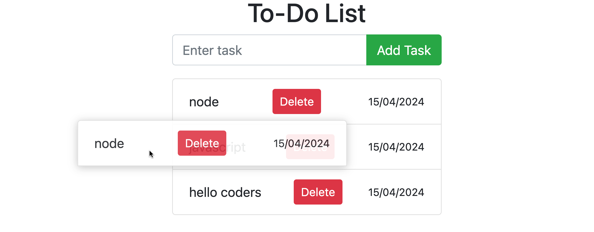

# To-Do List

A simple to-do list web application built with HTML, CSS, and JavaScript.

## Features

- Add tasks to your to-do list.
- Drag and drop to reorder tasks.
- Delete tasks individually.
- Tasks persist even after page reload using localStorage.

## Preview

## Getting Started

To run the application locally, follow these steps:

1. Clone this repository.
2. Open the `index.html` file in your web browser.

## Technologies Used

- HTML
- CSS (Bootstrap for styling)
- JavaScript

## How to Use

1. Enter a task in the input field.
2. Press Enter or click the "Add Task" button to add the task to the list.
3. Drag and drop tasks to reorder them.
4. Click the "Delete" button next to a task to remove it from the list.

## License

This project is licensed under the MIT License - see the [LICENSE](LICENSE) file for details.
